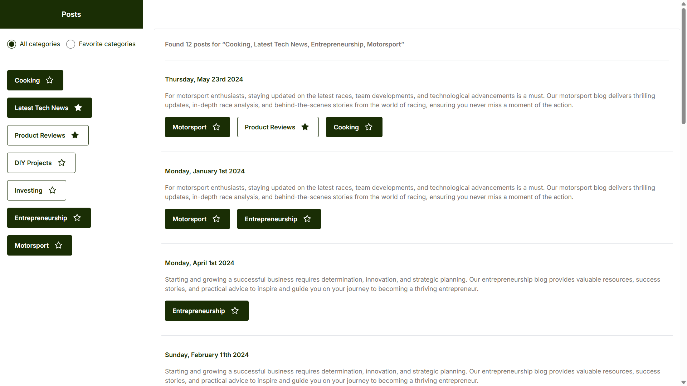

# 🗂️ Zypsy Frontend Exercise – Post Explorer

A fully responsive, category-based post browsing UI built with **React + TypeScript + Tailwind CSS**.  
This app demonstrates attention to detail in UX, maintainable architecture, and real-world performance patterns.



---

## ✨ Features

- ✅ Multi-category **selection** with real-time filtered posts
- ✅ Toggle **favorite categories** with ⭐️ icon
- ✅ **Responsive layout** (desktop sidebar / mobile tag-style)
- ✅ **LocalStorage** persistence for selected categories
- ✅ **Skeleton loaders** for smooth UX during data loading
- ✅ Toast notifications for clear user feedback
- ✅ Reusable components with clean props & logic
- ✅ Accessible structure (role-based buttons, keyboard support)

---

## 🛠 Tech Stack

| Layer        | Tools                             |
|--------------|-----------------------------------|
| Framework    | React 18 (with Vite)              |
| Language     | TypeScript                        |
| Styling      | Tailwind CSS                      |
| State/Query  | React Query (@tanstack/react-query) |
| UX Feedback  | React Hot Toast                   |
| Testing      | Jest + React Testing Library      |
| Mock Backend | Fastify + LowDB (JSON-based API)  |

---

## 📦 Requirements

- **Node.js:** `v20.18.3`
- **Package manager:** `npm` or `pnpm` recommended

> 🔍 React version used: **18.x**  
> React version is **not the same** as Node.js version. You can check it in `package.json`.

---

## 🚀 Getting Started

### 1. Clone the repository

```bash
git clone https://github.com/jabbar-app/zypsy-post-explorer.git
cd zypsy-post-explorer
```

### 2. Install dependencies

```bash
npm install
```

### 3. Run the frontend (Vite dev server)

```bash
npm run dev
```

### 4. (Optional) Start the mock backend server

```bash
cd backend
npm install
npm run dev
```

---

## 🧪 Running Tests

```bash
npm run test         # Run in watch mode
npm run test:coverage
```

Includes unit tests for components like:
- `CategoryPill`
- `StarToggle`
- `PostsList` (partial coverage)

---

## 🧱 Folder Structure

```
src/
├── components/          # All shared and smart components
│   ├── CategoryList.tsx
│   ├── CategoryFilter.tsx
│   ├── PostsList.tsx
│   ├── StarToggle.tsx
│   └── Skeleton.tsx
├── api.ts               # API interfaces
├── types.ts             # TypeScript types
├── App.tsx              # Layout and routing
├── index.tsx            # App bootstrap (React 18 + createRoot)
├── setupTests.ts        # Jest + RTL setup
└── ...
```

---

## 📱 Responsive Behavior

| Screen         | Layout style                        |
|----------------|-------------------------------------|
| Mobile (xs-sm) | Tags style (inline-wrapping pills)  |
| Tablet/Desktop | Vertical sidebar list, classic UI   |

---

## ♿ Accessibility

✅ Keyboard navigation supported  
✅ Accessible `role=button`, `aria-label` for interactive elements  
⚠️ Full WCAG audit **not yet performed**  
➡️ You can extend with `@axe-core/react` or `eslint-plugin-jsx-a11y`

---

## 📮 Contact

Made with 💚 by [@jabbar-app](https://github.com/jabbar-app)

Feel free to fork, contribute, or give feedback!